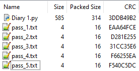
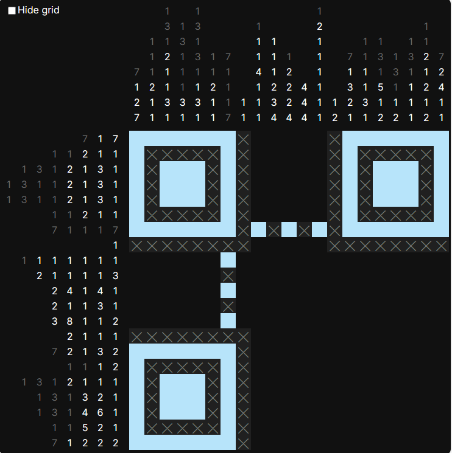
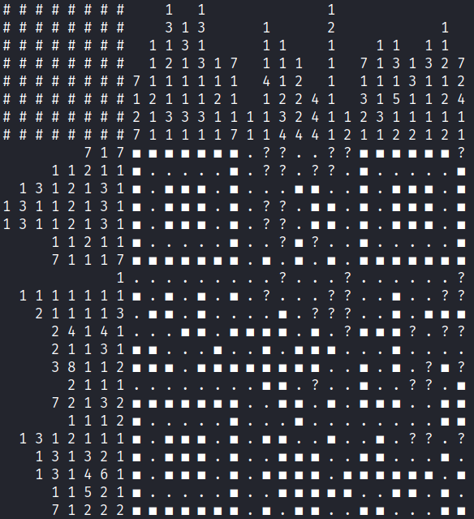
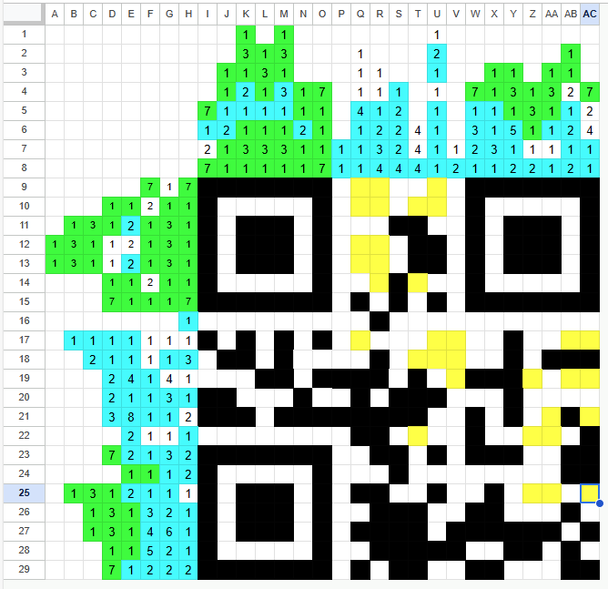

# Sheep Loves Maths

## Challenge
Sheep is fascinated about Maths and I found one of his diaries in an encrypted zip file. Can you spot his secret?
Note: The distributed zip file is intended to be password protected.

### Attachments
- [Sheep Loves Maths.zip](<./handouts/Sheep Loves Maths.zip>)

## Solution
In this challenge one is handed the encrypted [Sheep Loves Maths.zip](<./handouts/Sheep Loves Maths.zip>) file.

### Stage 1
The ZIP file format specifies a table of contents for the archive (unencrypted) as well as 32-bit CRC sums for the unencrypted contents of all the contained files - even if the archive itself has been encrypted!

On Windows e.g., one can use the program 7-Zip to read the table of contents as well as the CRC-sums of the files of a ZIP archive.



Looking at the table of contents as well as the (unpacked and unencrypted) file sizes, one can assume, that the password for archive has been split up into five sequences of four letters each and written into the files `pass_1.txt`, ..., `pass_5.txt` and in the end we want to access the contents of `Diary 1.txt`.

Luckily, CRC is a fast algorithm and the file sizes for `pass_*.txt` does not exceed four bytes each, which exactly matches the 32 bits of their respective CRCs, which let's us brute-force the contents of the `pass_*.txt` files by computing the CRCs of all four byte sequences and comparing them to the given CRC values to recover possible segments of the password.

To do so, one can use the Github repository `kmyk/zip-crc-cracker`, which is exactly designed to do so. Unfortunately the `crack.py` script tries to crack all the files of the archive including the `Diary 1.txt`, which is far to large to crack reliably, because one would need to brute force 585 bytes. To circumvent this issue, one can copy the archive to `Sheep_Loves_Maths_without_Diary_1_txt.zip` and simply remove the `Diary 1.txt` file (without requiring any knowledge of the archive's password) and subsequently use the command `python .\crack.py .\Sheep_Loves_Maths_without_Diary_1_txt.zip` to crack the contents of the `pass_*.txt` files within seconds:
- pass_1.txt : 'crc_'
- pass_2.txt : '15_f'
- pass_3.txt : 'un_m'
- pass_4.txt : '4th5'
- pass_5.txt : '!@@!'
Thus one obtains the password `crc_15_fun_m4th5!@@!` to go with the archive.

### Stage 2
After extracting [Sheep Loves Maths.zip](<./handouts/Sheep Loves Maths.zip>), one obtains the file [Diary 1.py](<./Diary 1.py>):
```python
from oeis import *

print("Maths puzzles are fun.")

res = input("Enter the secret code: ")

assert len(res) == 8
assert ord(res[0]) in A000142[:10]
assert ord(res[1]) in A004767[:100] and ord(res[1]) > A000203[36]
assert ord(res[2]) == ord(res[0]) - 1
assert ord(res[3]) in A000045[:20]
assert ord(res[4]) == 2 * (ord(res[3]) + 1)
assert ord(res[5]) == ord(res[1]) - 1
assert ord(res[6]) in A000217[13:20]
assert ord(res[7]) == A000040[4] ** 2

print(f"I am going to keep my next diary at: https://challs.vsc.tf/sheep-diary-{res}/")

print("The Sheep,\nJun 1, 2022")
```

At first glance, this python script contains a reference to OEIS®, which is [The On-Line Encyclopedia of Integer Sequences®](https://oeis.org/). This site lists various integer sequences, some of which are used to define constraints regarding the secret code one has to reverse engineer.

Additionally assuming, that all the eight characters of `res` have to be printable ASCII characters, one can define additional constraints `0x20 <= ord(res[i]) < 0x80`, which leads to the script [solver_diary1.py](./solver_diary1.py), that brute forces the remaining possibilities:
```python
from oeis import *
import requests

# Assuming "res" is a sequence of 8 printable characters (that can be part of a URL), we can expect 32 <= ord(res[i]) <= 127 for all 0 <= i <= 7.

min = 0x20 # omit the non-printable characters
max = 0x7E # 0x7F is a weird char to put into a URL; >= 0x80 is ANSII stuff; probably not worth checking.

# independant possibilities
possibilities = {
	0 : [x for x in A000142[:10] if min <= x-1 and x <= max], # conditions for indices 0 and 2 (depending on 0)
	1 : [x for x in A004767[:100] if min <= x-1 and x <= max and x > A000203[36]], # conditions for indices 1 and 5 (depending on 1)
	3 : [x for x in A000045[:20] if min <= x and 2*(x+1) <= max], # conditions for indices 3 and 4 (depending on 3)
	6 : [x for x in A000217[13:20] if min <= x and x <= max], # conditions for index 6
	7 : [A000040[4] ** 2] # conditions for index 7
}

# dependencies, defined in 'Diary 1.py'
#possibilities[2] = [x-1 for x in possibilities[0]]
#possibilities[4] = [2*(x+1) for x in possibilities[3]]
#possibilities[5] = [x-1 for x in possibilities[1]]

for v0 in possibilities[0]:
	# The character with index 2 is dependant on the character with index 0.
	v2 = v0 - 1
	for v1 in possibilities[1]:
		# The character with index 5 is dependant on the character with index 3.
		v5 = v1 - 1
		for v3 in possibilities[3]:
			# The character with index 4 is dependant on the character with index 3.
			v4 = 2 * (v3 + 1)
			for v6 in possibilities[6]:
				for v7 in possibilities[7]:
					seq = [v0, v1, v2, v3, v4, v5, v6, v7]
					res = ''.join([chr(x) for x in seq])
					# check URL:
					url = 'https://challs.vsc.tf/sheep-diary-' + res + '/'
					r = requests.get(url)
					#print(res, seq, url, r.status_code)
					if r.status_code == 200:
						print(url)
``` 

This script checks round about 50 combinations and tries to verify them by performing a GET request to the respective URLs. The only request returning a status code of 200 is [https://challs.vsc.tf/sheep-diary-xcw7pbx1/](https://challs.vsc.tf/sheep-diary-xcw7pbx1/), leading to the next stage.

### Stage 3

The next stage is a Nonogram, which one can solve either by hand or by using a tool. The blue markings and the `X`es were provided, leaving the blank spaces to be filled in.



Because it's often a hassle to reformat the data to fit certain tools and because one typically is not provided with given data for nonograms, I decided to appraoch this stage manually, while a team member attempted to solve the nonogram using the nonogrid github repository. Both of us took approximately the same amount of time to reach a similar progress:

Automated result using `nonogrid` and not using the supplied partial solution:



Note the questionmarks `?`, which the automated tool `nonogrid` could not resolve unambiguously, some of which also overlap with the given partial solution.

The manual result using the supplied partial solution with additional markings looks like this:



Note:
- The numbers marked in green represent the markings from the provided partial solution.
- The numbers marked in blue correspond to sequences of black fields, which have been placed in full length and where I additionally know the exact number the block corresponds to. (E.g. field Q15 could either correspond to the 1 in Q3 or the 1 in Q4, therefore I did not mark any of them blue.)
- The yellow fields are the fields, which could not be determined unambiguously. E.g. the 1s in H17 and H19 as well as the 2s in AB4 and AC5 could yield to a total of 2 more black fields in the rectangle AB17-AC19; either having AB17 and AC19 being black and AB19 and AC17 being white or vice versa.

Nonetheless the manual solution did not lack any information the `nonogrid` did compute, so I was quite happy going forward with the manually computed solution, which was even more detailed than the automated solution and obviously should display a QR code.

Unfortunately column Q and row 17 ain't fully restored, but the fields contained in this column and row contain vital information on the error correction and the mask pattern used during the encoding.

There's two ways forward from here:

1. Either one can brute force the remaining possibilities until error correction kicks in and hopefully yields the correct solution.
2. Get lucky with the QC code app (of your choice) on your mobile device and land a lucky read (maybe due to distortion and/or rotation of the image), which I did: `u.nu/MSuLm`

### Stage 4

Opening the URL [http://u.nu/MSuLm](http://u.nu/MSuLm) redirects to [https://pastebin.com/dACk3P8Z](https://pastebin.com/dACk3P8Z), which in turn displayed the following note:
```
Maths is beautiful because it is self-referential; sometimes the numbercan draw itself...
 
I saved my flag in the realm of Maths: 1063393121310898047440997725762294544029908835809751515233253579244240492934607631645356036450240642260454804473654669572323961444785058718528706522740208196184838118044932269513380820669803768648373344618038560721615974289561223130460911576033453894371412033044978946967348031383537030191809078831781838658185847411787395701090489521928006895328970739281759532549286899152438525573456211852361913725920657593636245466759230041653370214528181964286175428694573408609668069438760741997264361296597738559926437885050749385876509638211936836155868
 
The Sheep,
Jun 17, 2022
```

According to Tupper's self-referential formula, one can write a small script [tupper.py](./tupper.py) to decode the number into an ascii art [tupper.txt](./tupper.txt):
```python
import codecs
import os

def tuppers_formula(x, y):
	"""Return True if point (x, y) (x and y both start at 0) is to be drawn black, False otherwise
	"""
	k = 1063393121310898047440997725762294544029908835809751515233253579244240492934607631645356036450240642260454804473654669572323961444785058718528706522740208196184838118044932269513380820669803768648373344618038560721615974289561223130460911576033453894371412033044978946967348031383537030191809078831781838658185847411787395701090489521928006895328970739281759532549286899152438525573456211852361913725920657593636245466759230041653370214528181964286175428694573408609668069438760741997264361296597738559926437885050749385876509638211936836155868
	return ((k + y)//17//2**(17*int(x) + int(y)%17))%2 > 0.5

with codecs.open("tupper.txt", "w", "utf-8") as f:
	values = [[tuppers_formula(x, y) for x in range(106)] for y in range(17)]
	for row in values:
		for value in row[::-1]:   # x = 0 starts at the left so reverse the whole row
			if value:
				f.write("\u2588") # Write a block
			else:
				f.write(" ")
		f.write(os.linesep)
```

```
  █  █   ███  ██  █   █  █    ██ █ ███ ███  ███ █   █ █  █   ███ ███ █   █  █  ██    █  ███  ███  ██   █  
 █           █  █ █   █  █   █    █  █     █    █   █ █  █         █ █   █  █   █    █    █    █ █    ███ 
 █   █       █  █ █ █ █ ████  ██  █  █     █    █ █ █ █ ████       █ █ █ █ ████ █    █    █    █  ██ ██ ██
 █   █       █  █ █ █ █  █ █   █  █  █     ████ █ █ █ █  █ █       █ █ █ █  █ █  █  ███ ████   █   █ █   █
█    █        ██  █████  ██  ██            █    █████    ██      ███ █████  ██  █    █    █  ███ ██  █   █
 █  █                    █                  ███       █  █                  █   █   ██    █               
 █  █  █                                                                       ██                         
 ██ ███                                                                                                   
                                                                                                          
                                                                                                          
                                                                                                          
    ███████████████████               ████          █████           ██████████████████████ ███         ███
█████                 ██████       ███    ██████████    ███       ███                    ███ ███████████ █
█                          █       █                      █       █                                      █
█████                 ██████       ███    ██████████    ███       ███                    ███ ███████████ █
    ███████████████████               ████          ████            ██████████████████████ ███         ███
```

After rotating the image 180 degrees, we can read the flag `vsctf{4mc_4im3_us4mo_?}`.

## Resources
- [Wikipedia: ZIP (file format)](https://en.wikipedia.org/wiki/ZIP_(file_format)#Design)
- [7-Zip](https://www.7-zip.org/) (for Windows)
- [Github: kmyk/zip-crc-cracker](https://github.com/kmyk/zip-crc-cracker/blob/master/crack.py)
- [The On-Line Encyclopedia of Integer Sequences® (OEIS®)](https://oeis.org/)
- [Wikipedia: Nonogram](https://en.wikipedia.org/wiki/Nonogram)
- [Github: tsionyx/nonogrid](https://github.com/tsionyx/nonogrid)
- [Wikipedia: QR code](https://en.wikipedia.org/wiki/QR_code)
- [Wikipedia: Tupper's self-referential formula](https://en.wikipedia.org/wiki/Tupper's_self-referential_formula)
- [Youtube: The 'Everything' Formula - Numberphile](https://www.youtube.com/watch?v=_s5RFgd59ao)